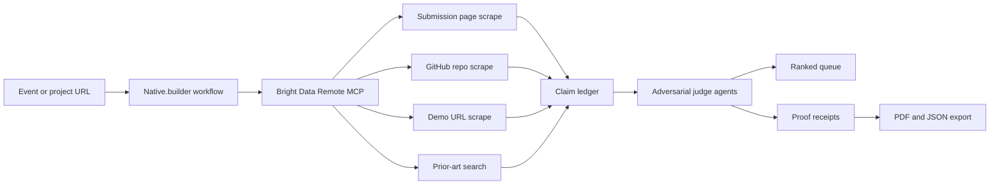

# ProofRank Bright Data Readiness Brief

Date: 2026-08-07
Event: AI Factory Native.builder Hackathon
Target prize: Best Agentic Use of Bright Data

## Executive Call

ProofRank should compete as a sponsor-side judge workbench: it reviews real hackathon projects by combining lablab submission pages, GitHub repositories, deployed demos, prior-art search, and proof receipts into a ranked review queue.

The winning angle is not "another research assistant." It is an evidence control plane for hackathon judging: live web collection becomes a defensible decision artifact.

## What I Need From The User

These are the pieces I cannot ethically or technically complete without the account owner:

1. Native.builder access
   - Complete the Native.builder login flow.
   - Apply `AIFACTORY26` if the builder plan screen appears.
   - Publish the native.builder app and give me the final public Native app URL.

2. Bright Data access
   - Create or open the Bright Data account.
   - Apply `aiaccess50`.
   - Provide a Bright Data API token, preferably scoped to the hackathon account.
   - Confirm a spend cap, because Pro/browser/data-feed tools may be billed differently from the free MCP tier.

3. Real reviewer target
   - Provide the GitHub URL of the actual hackathon project you want reviewed.
   - Provide the deployed app/demo URL for that project.
   - If the repo is private, either make it public for judging or provide a read-only token with the smallest practical scope.
   - Confirm I may crawl the repo, README, issues, release assets, commit history, package files, and public deployment.

4. Final submission authority
   - Confirm the team name and exact author details.
   - Let me know which demo URL should be primary: native.builder URL first, GitHub Pages fallback second.
   - Approve the final lablab.ai submission because only your authenticated account can submit.

5. Optional model/API key
   - Pick exactly one of AI/ML API or Featherless if we add a second LLM provider through partner credits.
   - Provide OpenAI/Anthropic/AI/ML/Featherless credentials only if you want live LLM adjudication beyond deterministic scoring.

## What Is Left For True End-To-End Use

1. Server-side Bright Data executor
   - Current static app models the traces and review packet.
   - Real mode needs a backend or native.builder workflow that calls Bright Data Remote MCP or REST from the server side.
   - Tokens must never be stored in client JavaScript.

2. Live project ingestion
   - Fetch lablab submission page.
   - Fetch linked GitHub repo metadata, README, package files, license, commits, releases, and public issues.
   - Fetch deployed demo content and capture basic availability evidence.
   - Run prior-art queries against project title, team, core claim, and suspiciously similar projects.

3. Evidence normalization
   - Convert each source into a claim ledger.
   - Label every claim as verified, unsupported, contradicted, stale, inaccessible, or unknown.
   - Keep raw source URL, retrieval timestamp, Bright Data tool, query, and hash for each receipt.

4. Adversarial judge loop
   - Add one agent that argues for sponsor fit.
   - Add one agent that argues against sponsor fit.
   - Add one agent that checks whether Bright Data was truly load-bearing.
   - Final result should include a dispute log, not just a score.

5. Export package
   - Generate a judge-ready PDF proof packet.
   - Generate a JSON audit artifact.
   - Generate a one-page sponsor summary.
   - Generate a short demo script from the actual run.

6. Native.builder implementation proof
   - Rebuild or mirror the final experience in native.builder.
   - Keep visible "built with native.builder" process evidence: workflow names, screenshots, generated routes, and public deployment.

## Research Pattern From Prior Bright Data Winners

The strongest Bright Data projects make live data load-bearing and decision-shaped:

- Verdict turned live web and sanctions checks into APPROVE / ESCALATE / BLOCK counterparty decisions with cited evidence, hostile-content handling, citation verification, risk scoring, and PDF audit export.
- ConsumerIQ turned marketplace and social scraping into Build / Pivot / Stop / Refine startup validation.
- ShotSpot used Bright Data discovery plus multimodal processing to turn web video discovery into timestamped training data, with a public repo and production-shaped architecture.
- LangBridge AI used Bright Data MCP to pull live regional web context, then generated localized marketing content; it won the Bright Data MCP sponsor track in the MCP-AWS challenge.

The common pattern:

1. High-value user with a painful manual workflow.
2. Live web data is central, not decorative.
3. Output is a decision or work product, not a generic summary.
4. Proof is visible: citations, trace, timestamps, and source-backed claims.
5. The demo proves one complete run on real public data.

## Current AI Factory Competitive Field

Strong current competitors already target source-backed decisions:

- Half-Life watches the assumptions behind business decisions and retracts decisions when live-web evidence invalidates premises.
- CivicTwin recompiles regulatory rules and proof receipts when a founder changes an operating choice.
- Querypex focuses on transparent data analysis where every answer shows the executed SQL.

ProofRank should stand apart by judging the judges' own problem: hackathon sponsors need to know which submissions are real, original, accessible, and genuinely using their tool. It is meta to the event, but practically useful to Bright Data, lablab.ai, accelerators, and sponsor teams.

## Features To Add For A Stronger Submission

1. Real GitHub reviewer lane
   - User gives a repo URL and demo URL.
   - ProofRank extracts README claims, dependencies, deployment links, commits during the hackathon window, and evidence of Bright Data integration.
   - It flags secrets, private/inaccessible links, copied README text, and missing license.

2. Bright Data trace replay
   - Every receipt gets a "replay query" field.
   - Judges can see the exact MCP tool, URL/query, result count, and retrieval time.

3. Originality radar
   - Search title, tagline, key architecture claims, and code phrases.
   - Separate "common idea" from "direct copy risk."

4. Demo proof runner
   - Check the public demo URL.
   - Record HTTP status, page title, obvious broken states, and whether critical text appears.
   - Optional browser screenshot if Bright Data browser tools are enabled.

5. Sponsor-fit tribunal
   - Three perspectives: Bright Data judge, skeptical hackathon judge, business buyer.
   - The final receipt includes where they agree and disagree.

6. No-demo-data mode
   - Remove sample fixture dependency once credentials are present.
   - Show unknown states instead of silently substituting canned evidence.

7. Submission composer
   - Create final lablab fields, tool list, demo script, and "how native.builder was used" explanation from the actual proof run.

## Candidate Live Architecture

## Source URLs Used In This Brief

- Current hackathon: https://lablab.ai/ai-hackathons/nativebuilder-build-without-limits
- Web Data UNLOCKED results: https://lablab.ai/ai-hackathons/brightdata-ai-agents-web-data-hackathon/live
- Verdict: https://lablab.ai/ai-hackathons/brightdata-ai-agents-web-data-hackathon/verdict/verdict-ai-counterparty-due-diligence-agent
- ConsumerIQ repo: https://github.com/AMD-Hackathon-ISPM/BrightData-ConsumerIQ
- ShotSpot Devpost: https://devpost.com/software/shotspot-kfvp1n
- ShotSpot repo: https://github.com/aedutta/shot-spot-treehacks-26
- LangBridge AI Devpost: https://devpost.com/software/langbridge-ai
- Bright Data MCP repo: https://github.com/brightdata/brightdata-mcp
- Bright Data skills repo: https://github.com/brightdata/skills
